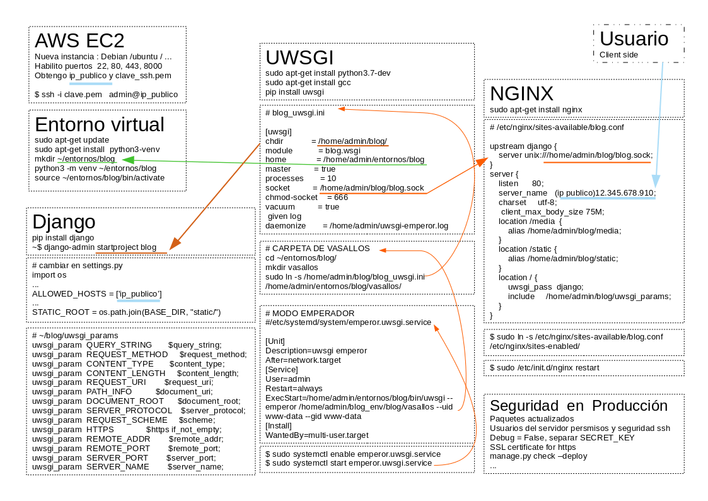

# AWS-EC2 production depoy: Django + NGINX + uWSGI

Desplegar un servidor Django para producción en una instancia de
Elastic Computer Cloud en  Amazon web services
usando  y el servidor web enginex y uWSGI


***

# Crear nueva instancia EC2
Luego, para añadir un puerto en aws EC2:
* Red y Seguridad
* security Groups
* select group
* reglas de entrada
* editar reglas de entrada
* agregar regla
* HTTPS
* 0.0.0.0/0
* guardar reglas


# conexión al server
La primera vez con el archivo .pem  luego agrego pub_key en ..ssh/authorized_keys

    chmod 400 my_username_aws.pem
    ssh -i "my_username_aws.pem" admin@XXXXXXYYYYYY.us-east-2.compute.amazonaws.com


***
# Crear un entorno virtual  con Virtual env

    sudo apt-get update
    sudo apt-get install  python3-venv
    mkdir ~/entornos/blog
    python3 -m venv ~/entornos/blog
    source ~/entornos/blog/bin/activate

***
# Instalar Django

    pip install django
    django-admin startproject blog
    #cambiar en settings.py allowed host para el ip público
    ./manage.py runserver 0.0.0.0:8000

    verifico en el navegador:
    http:ip_publico:8000

***

# UWSGI  (intermedio entre Django y el web-server)  web server gateway interface

    sudo apt-get install python3.7-dev
    sudo apt-get install gcc
    pip install uwsgi

para probar el servidor uwsgi,  guardo en test.py:
```python
    def application(env, start_response):
        start_response('200 OK', [('Content-Type','text/html')])
        return [b"hola mundo!"]
```
corro el test con:

    uwsgi --http :8000 --wsgi-file test.py

para servir a la app:

    ~/blog$ uwsgi --http :8000 --module blog.wsgi


***
# NGINX servidor web
instalo con:

    sudo apt-get install nginx

configuración para nginx apuntando a los archivos estáticos y media --
creo sock al que se conectará wsgi

    nano /etc/nginx/sites-available/blog.conf

dentro de blog.conf, pego el siguiente código con shift-ctrl-v
```
upstream django {
    server unix:///home/admin/blog/blog.sock;
}
# configuration of the server
server {
    listen      80;
    server_name ;
    charset     utf-8;
    # max upload size
    client_max_body_size 75M;
    # Django media and static files
    location /media  {
        alias /home/admin/blog/media;
    }
    location /static {
        alias /home/admin/blog/static;
    }
    # Send all non-media requests to the Django server.
    location / {
        uwsgi_pass  django;
        include     /home/admin/blog/uwsgi_params;
    }
}

```


creo con nano el archivo ~/blog/uwsgi_params  y pego:
```
uwsgi_param  QUERY_STRING       $query_string;
uwsgi_param  REQUEST_METHOD     $request_method;
uwsgi_param  CONTENT_TYPE       $content_type;
uwsgi_param  CONTENT_LENGTH     $content_length;
uwsgi_param  REQUEST_URI        $request_uri;
uwsgi_param  PATH_INFO          $document_uri;
uwsgi_param  DOCUMENT_ROOT      $document_root;
uwsgi_param  SERVER_PROTOCOL    $server_protocol;
uwsgi_param  REQUEST_SCHEME     $scheme;
uwsgi_param  HTTPS              $https if_not_empty;
uwsgi_param  REMOTE_ADDR        $remote_addr;
uwsgi_param  REMOTE_PORT        $remote_port;
uwsgi_param  SERVER_PORT        $server_port;
uwsgi_param  SERVER_NAME        $server_name;
```


    sudo ln -s /etc/nginx/sites-available/blog.conf /etc/nginx/sites-enabled/


```python
# en settings.py
import os
from pathlib import Path
# Build paths inside the project like this: BASE_DIR / 'subdir'.
BASE_DIR = Path(__file__).resolve().parent.parent
...
STATIC_URL = '/static/'
STATIC_ROOT = os.path.join(BASE_DIR, "static/")
```


collectar arvhivos estáticos:

    ./manage.py collectstatic

reinicio el servidor NginX

    sudo /etc/init.d/nginx restart

test para el servicio de archivos estáticos con NginX:

    mkdir media
    cd media
    wget www.some.site/some_image.png

    #uwsgi conecta el socket de nginx  con el archivo wsgi de django
    uwsgi --socket  blog.sock --module blog.wsgi --chmod-socket=666

abrir IP con el navegador y ver inicio django

***
# Configuración para PRODUCCIÓN

```
#~/blog/blog_uwsgi.ini

[uwsgi]
chdir            = /home/admin/blog/
module           = blog.wsgi
home             = /home/admin/entornos/blog
master          = true
processes       = 10
socket          = /home/admin/blog/blog.sock
chmod-socket    = 666
vacuum          = true
daemonize       = /home/admin/uwsgi-emperor.log
```

luego puedo iniciar con:

    uwsgi --ini blog_uwsgi.ini

***
# Modo EMPERADOR para uwsgi
atualiza el servicio ante cambios en la configuración y activa nuevas instancias que se creen en la carpeta de los vasallos

    cd ~/entornos/blog/
    mkdir vasallos


      uwsgi --emperor /home/udoms/entornos/blog/vasallos --uid www-data --gid www-data

    top
    sudo system reboot

***
creo un systemd file para que corra todo en arranque

    sudo nano /etc/systemd/system/emperor.uwsgi.service
```
[Unit]
Description=uwsgi emperor for site
After=network.target
[Service]
User=admin
Restart=always
ExecStart=/home/admin/entornos/blog/bin/uwsgi --emperor /home/admin/entornos/blog/vasallos --uid www-data --gid www-data
[Install]
WantedBy=multi-user.target
```


activo con enable permite que arranque en el reinico:

    sudo systemctl enable emperor.uwsgi.service
    sudo systemctl start emperor.uwsgi.service


puedo reiniciar el sitema y verificar que el servicio inicia automáticamente

    sudo reboot


***

# FREE ssl certificte  https://certbot.eff.org/
(no sirve para IPs sin dominio)

    sudo apt update
    sudo apt install snapd
    sudo snap install --classic certbot
    sudo ln  -s /snap/bin/certbot /usr/bin/certbot

    sudo certbot --nginx
    >> email for renew alert every 90 days!


***
