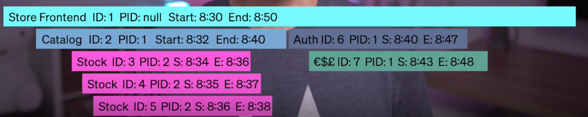

# Software Reliability Engineering
mission: sustainably practices to help  an organization to achieve an appropriate level of reliability
[check](https://www.youtube.com/watch?v=dplGoewF4DA)


## Service Levels


* **SLI**: Service Level Indicator, examples:
  * successfull HTTP calls / total HTTP calls  in specific part, ie the load balancer
  * Number of operations in t <10ms
  * full quality responses / total responses
* **SLO**: Service Level Objetive
  * for example sucefull HTTP serve 90% of the time
  * error budget: you can fail 10 % of the time
* **SLA**: Service Level Agreement

These allow to have common goals and standards, and talking about objective data, not feelings about the quality of the current state.

## How Reliable is your system?

parameters for reliability:
* availability
* latency
* coverage
* throughput
* quality
* correctness
* freshness
* durability

## Service reliability hierarchy  (pyramid)
from base to top:
1. monitoring:
  * Logs
  * Metrics: understand the current state of the system in comparation with normal state
  * Alert: setup alerts when metrics are not normal
  * Observability: tracing, follow an event, for example  requests between functions and services, to find the root of the problem.
2. Incident Response:
  * how to structure the production process, declare incidents, and management
  * the primary goal is to fix the problem, going back to normal operation state:
    * give tools, instructions and power to the person that attends the response to solve the issue (at least temporarily)
    * communicate, to make the response easier by making everybody aware of the procedures
3. Postmortem / root cause analysis:
  * learn form the experience,
  * how can you prevent this from happening again?
    * can this be solved with training and better documentation?
    * can this be automated?
4. Testing + Release procedures:
  * build test and procedure to detect problems before production deployment
5. capacity planning:
  * design the system architecture to be resilient to  failure, handle:
    * scaling
    * overload
  * avoid cascade Failure
  * use best practices of the cloud provider
6. Development: implement a culture of reliability from the development stage
7. Product: finally obtain a product with:
  * client requirements
  * **reliable** and **resilient** architecture


## Chaos Engineering
Experimentig with failure.

Failure is inevitable, use it to you learn.

Apply scientific method  to learn about the system to make it more resilient.

1. Build the system
2. Make hypothesis about how it would response to failure
3. Inject the the failure, collect data and analyze it to get a better understanding of the real system response in comparation with your previous hypothesis
4. Make data driven architecture decisions to improve the resilience of the system
5. Repeat the cycle:
  * build
  * make it fail
  * learn
  * repeat


## Observability
[from](https://www.youtube.com/watch?v=orsxOxQNzDQ)

acordding wikipedia: [Observability](https://en.wikipedia.org/wiki/Observability) is how well the internal state of a system can be inferred form knowledge of its external outputs.

 But within the context of SRE, its the ability to see inside the system (without the need of infer ),  follow the inputs and outputs, tracing time to detect bottlenecks.

+ metrics
+ logging
+ tracing


 It means distributed tracing:
 * get request
 * track the work that is activated, and its interaction with other parts of the system
 * Tracing spams:
  * spam ID
  * parent spam ID
  * start time
  * end time


**check tracing tools for you language**

To avoid the computational cost of tracing every request, you usually take samples.

 example: browser inspector : net with loading time of each request

***

[Read more](https://www.gremlin.com/community/tutorials/using-observability-to-automatically-generate-chaos-experiments/)


### References


* **The Site Reliability Workbook: Practical Ways to Implement SRE** , 2016, Betsy Beyer, Chris Jones, Jennifer Petoff, Niall Richard Murphy
* **The Site Reliability Workbook: Practical Ways to Implement SRE**, 2018, Betsy Beyer et al.
* **Seeking SRE: Conversations About Running Production Systems at Scale** , 2018, David N. Blank-Edelman


<!--
```
@book{book:{seeking_sre},
   title =     {Seeking SRE: Conversations About Running Production Systems at Scale},
   author =    {David N. Blank-Edelman},
   publisher = {O’Reilly Media},
   isbn =      {1491978864; 9781491978863},
   year =      {2018},
   edition =   {1},
}

@book{book:{sre_google},
  title =     {Site Reliability Engineering: How Google Runs Production Systems},
  author =    {Betsy Beyer, Chris Jones, Jennifer Petoff, Niall Richard Murphy},
  publisher = {O’Reilly Media},
  isbn =      {149192912X; 9781491929124},
  year =      {2016},
  edition =   {1},
}

@book{book:{sre_workbook},
   title =     {The Site Reliability Workbook: Practical Ways to Implement SRE},
   author =    {Betsy Beyer et al. (eds.)},
   publisher = {O’Reilly},
   isbn =      {1492029505; 9781492029502},
   year =      {2018},
}

```
-->
